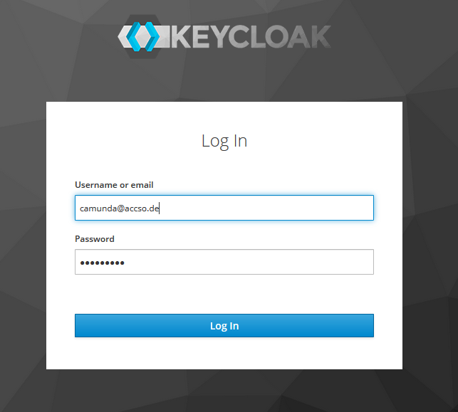
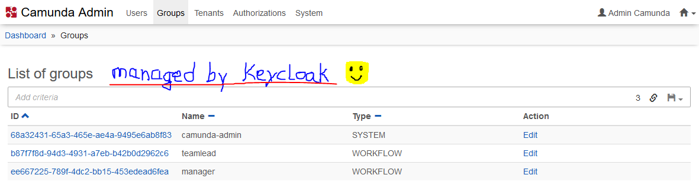
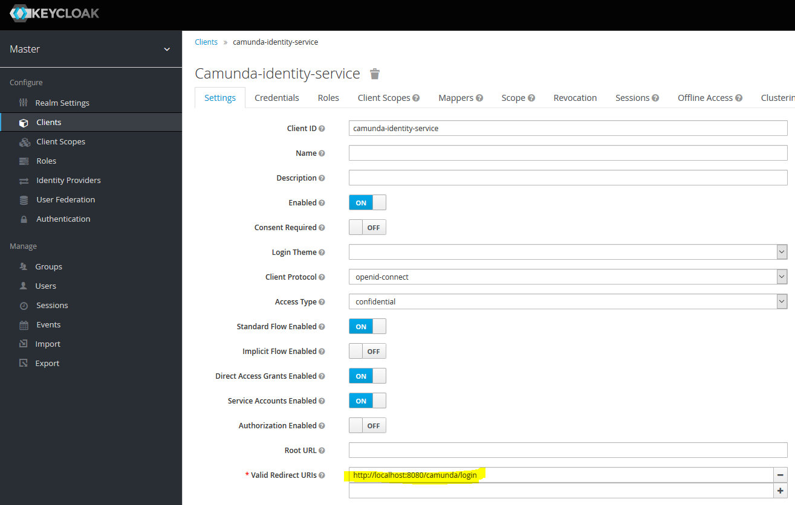

# Camunda Showcase for Spring Boot & Keycloak Identity Provider

## What it does

This is a basic showcase for a Camunda Spring Boot application using a [Keycloak Identity Provider Plugin](https://github.com/VonDerBeck/camunda-identity-keycloak).

You will not only login using Keycloak (or if configured using your preferred social identity provider)

 

but most importantly get Users and Groups in Camunda managed by Keycloak as well

 

## Prerequisites

You will need JDK 11, Maven.
    
## Build process

The build process uses Maven.

<table>
    <tr>
        <td><b>Target</b></td>
        <td>&nbsp;</td>
        <td><b>Maven Goal</b></td>
    </tr>
    <tr>
        <td>Build Spring Boot Jar</td>	
        <td>&nbsp;</td>
        <td><code>clean install</code></td>	
    </tr>
    <tr>
    	<td>Run Spring Boot App</td>
        <td>&nbsp;</td>
    	<td><code>spring-boot:run</code></td>
    </tr>
</table>

## Show me the important parts

The following description is a quick start. A more detailed description will follow.

### Run it

1.  Start Keycloak Server as described below.
2.  Run this project as Spring Boot App.
3.  Point a new private window of your browser to ``localhost:8080/camunda``
4.  Login with camunda@accso.de / camunda1!
5.  Choose the admin console and browse users and groups from Keycloak

### Keycloak server - local test setup

Use a ``docker-compose.yml`` file as follows:

	version: "3.3"
	
	services:
	  jboss.keycloak:
	    build: .
	#    image: jboss/keycloak
	    image: gunnaraccso/keycloak.server:5.0.0
	    restart: always
	    environment:
	      TZ: Europe/Berlin
	      KEYCLOAK_USER: keycloak
	      KEYCLOAK_PASSWORD: keycloak1!
	    ports:
	      - "9001:8443"
	      - "9000:8080"

The image ``gunnaraccso/keycloak.server`` has been derived from the original ``jboss/keycloak`` docker image. It additionally includes a basic test setup matching the test configuration of this project. The image exists only for demonstration purposes. Do not use in production. For original Keycloak docker images see [Keycloak Docker image](https://hub.docker.com/r/jboss/keycloak/).

The only thing you have to adapt is the **Redirect URI** of the Camuna Identity Service Client. Login at the [Keycloak Admin Console](https://localhost:9001/auth/admin/master/console/#/) using user/password as configured above and set ``http://localhost:8080/camunda/login`` as Valid Redirect URI configuration:

 

**Beware**: This is a first basic test setup which currently still uses the Master realm. For production I would strongly encourage you to setup your own realm and use Master only for administration purposes. In a future version this showcase will be modified as well.

For further details on how to setup a Keycloak Camunda Identity Service Client see documentation of [Keycloak Identity Provider Plugin](https://github.com/VonDerBeck/camunda-identity-keycloak) 

### Keycloak Identity Provider Plugin

``KeycloakIdentityProvider.java`` in package ``de.vonderbeck.bpm.showcase.plugin`` will activate the plugin.

The configuration part in ``applicaton.yaml`` is as follows:

	keycloak.url.plugin: ${KEYCLOAK_URL_PLUGIN:https://localhost:9001}

	plugin.identity.keycloak:
	  keycloakIssuerUrl: ${keycloak.url.plugin}/auth/realms/master
	  keycloakAdminUrl: ${keycloak.url.plugin}/auth/admin/realms/master
	  clientId: camunda-identity-service
	  clientSecret: 7d3c845d-f652-4bed-9797-d6d20b7623da
	  useEmailAsCamundaUserId: true
	  useUsernameAsCamundaUserId: false
	  administratorGroupName: camunda-admin
	  disableSSLCertificateValidation: true
	  
For configuration details of the plugin see documentation of [Keycloak Identity Provider Plugin](https://github.com/VonDerBeck/camunda-identity-keycloak) 

### OAuth2 SSO Configuration

See package ``de.vonderbeck.bpm.showcase.sso``.

The main configuration part in ``applicaton.yaml`` is as follows:

	keycloak.url.client: ${KEYCLOAK_URL_CLIENT:http://localhost:9000}
	keycloak.url.token: ${KEYCLOAK_URL_TOKEN:http://localhost:9000}

	security:
	  basic:
	    enabled: false
	  oauth2:
	    client:
	      client-id: camunda-identity-service
	      client-secret: 7d3c845d-f652-4bed-9797-d6d20b7623da
	      accessTokenUri: ${keycloak.url.token}/auth/realms/master/protocol/openid-connect/token
	      userAuthorizationUri: ${keycloak.url.client}/auth/realms/master/protocol/openid-connect/auth
	      scope: openid profile email
	    resource:
	      userInfoUri: ${keycloak.url.client}/auth/realms/master/protocol/openid-connect/userinfo

### Kubernetes Setup

TODO